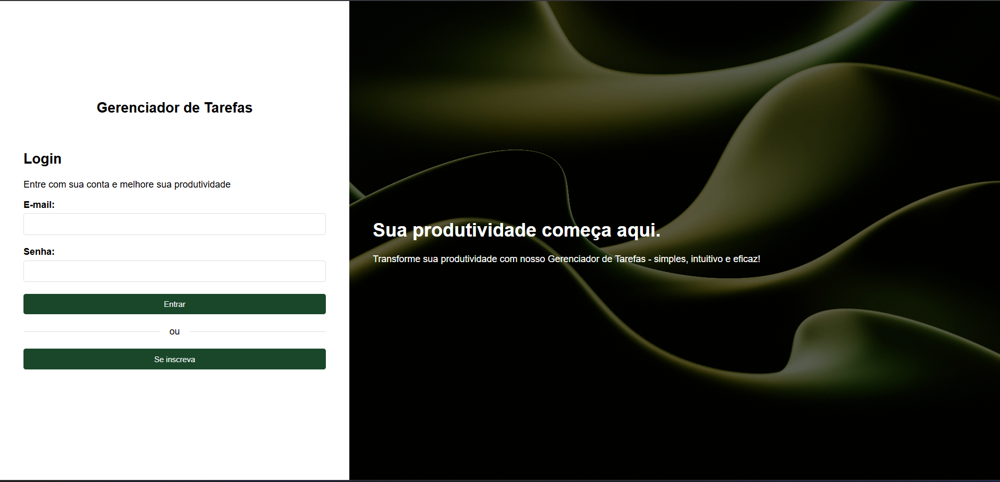
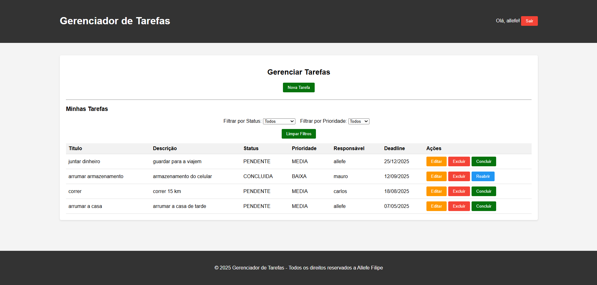

# 📋 Gerenciador de Tarefas

O Gerenciador de Tarefas é uma aplicação web Java que permite aos usuários gerenciar suas tarefas diárias de forma eficiente. O sistema oferece funcionalidades de cadastro de usuários, login seguro, e um painel para criar, editar, filtrar e gerenciar tarefas com diferentes prioridades e status.

## 🌐 Demonstração Online

🔗 **Aplicação em produção**: [https://gerenciador-tarefa-f423977c9e1b.herokuapp.com/](https://gerenciador-tarefa-f423977c9e1b.herokuapp.com/)

## 📸 Screenshots

### Tela de Login

### Dashboard Principal

## 🎯 Funcionalidades

- ✅ **Sistema de autenticação** com cadastro e login de usuários
- ✅ **Gerenciamento completo de tarefas** (criar, editar, excluir, concluir)
- ✅ **Filtros avançados** por status e prioridade
- ✅ **Atribuição de responsáveis** para cada tarefa
- ✅ **Interface responsiva** e intuitiva
- ✅ **Segurança** com hash de senhas e filtros de autenticação

## ⭐ Requisitos Implementados

### Obrigatórios
- **a)** ✅ Aplicação Java Web utilizando JavaServer Faces (JSF)
- **b)** ✅ Persistência em banco de dados PostgreSQL

### Opcionais (Diferenciais)
- **c)** ✅ Utilização de JPA para persistência
- **d)** ✅ Testes unitários implementados
- **e)** ✅ Deploy no Heroku (ambiente cloud)
- **f)** ✅ **Diferenciais adicionais**:
  - Sistema completo de autenticação e autorização
  - Interface de usuário intuitiva e responsiva
  - Filtros avançados para gerenciamento de tarefas
  - Sistema de atribuição de responsáveis
  - Segurança com hash de senhas

## 🛠️ Tecnologias Utilizadas

### Backend
- **Java EE (Jakarta EE)**: Base da aplicação
- **JSF (JavaServer Faces) 2.x**: Framework MVC para interfaces web
- **Facelets**: Sistema de templates do JSF, usando arquivos XHTML
- **JPA (Java Persistence API)**: Para mapeamento objeto-relacional
- **Hibernate**: Implementação do JPA para persistência de dados
- **PostgreSQL**: Banco de dados relacional

### Servidor
- **Apache Tomcat**: Servidor de aplicação

### Testes
- **JUnit 5**: Framework de testes unitários
- **Mockito**: Framework para criação de mocks
- **H2 Database**: Banco em memória para testes

## 📊 Banco de Dados

O sistema utiliza PostgreSQL com duas tabelas principais:

### 1. Tabela de Usuários (usuarios)
- Armazena informações de usuários (id, nome, email, senha, data_cadastro)
- Senhas são armazenadas com hash MD5 para segurança

### 2. Tabela de Tarefas (tarefas)
- Armazena as tarefas dos usuários (id, titulo, descricao, status, prioridade, data_criacao, data_conclusao)
- Relacionamento N:1 com a tabela de usuários (cada tarefa pertence a um usuário)

## 🧪 Testes Implementados

O projeto conta com uma suíte completa de testes unitários que cobrem três camadas da aplicação:

### 1. TarefaServiceTest - Camada de Serviço
- Testa a lógica de negócios da aplicação
- Verifica operações de salvar e concluir tarefas

### 2. TarefaRepositoryTest - Camada de Persistência
- Testa a interação com o banco de dados
- Verifica operações de CRUD e consultas específicas

### 3. TarefaBeanTest - Camada de Controle
- Testa os managed beans do JSF
- Verifica a integração entre interface e lógica de negócios

### Técnicas Utilizadas
- **Mocks**: Para isolamento de dependências
- **Banco H2 em memória**: Para testes de persistência
- **Injeção de dependências**: Para substituição de componentes
- **Wrapper para FacesContext**: Para tornar o código mais testável

## 🚀 Como Executar Localmente

### Pré-requisitos
- Java 8 ou superior
- Apache Tomcat 9+
- PostgreSQL
- Maven (para gerenciamento de dependências)

### Passos para Execução

1. **Clone o repositório**
- git clone https://github.com/allefe/gerenciador-tarefas.git
-  cd gerenciador-tarefas
  
2. **Configure o banco de dados PostgreSQL**
- Crie um banco de dados chamado `gerenciador_tarefas`
- Configure as credenciais de acesso

3. **Configure o arquivo de persistência**
para uso local, use o persistence.xml.template, copie o codigo dele e coloque em: persistence.xml

4. **Compile o projeto**
